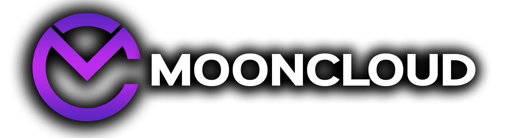

  

  # Moonup
  
  **Der offizielle Addon-Manager für die Mooncloud Community**

  
  
  

   

  [**⬇️ Download für Windows & Mac**](https://github.com/Mooncloudgg/MoonUp/releases/latest)

---

## 🚀 Über das Projekt

**Moonup** ist ein maßgeschneidertes Tool für unsere Gilde, das sicherstellt, dass alle Mitglieder immer die korrekten Versionen unserer internen Addons nutzen. Es eliminiert Versionskonflikte und macht Updates kinderleicht – unabhängig davon, welchen Addon-Manager (wie WoWUP oder Curse) du sonst verwendest.

### Unterstütze Addons:
* **TimelineReminders** (Pflicht): Display Raid Assignments & Personal Assignments
* **MooncloudTools** (Pflicht): Interne Tools für den Raid-Betrieb.
* **QUI** (Optional): Free QUI Community Version. [**Offizielles Repo von Zol**](https://github.com/zol-wow/QUI)

### Features:
* ✅ **Automatische Updates:** Erkennt sofort, wenn wir eine neue Version auf GitHub pushen.
* ✅ **Sicherheit:** Zugriff nur mit gültigem Discord Login.
* ✅ **Optionale Addons:** Wähle selbst, ob du zusätzliche Pakete wie QUI installieren möchtest.
* ✅ **Cross-Platform:** Läuft nativ auf Windows und macOS (Apple Silicon & Intel).

---

## 🛡️ Sicherheit & Transparenz

Da Moonup ein privates Community-Projekt ist und keine kostspielige digitale Signatur (Code Signing Zertifikat) besitzt, stufen Windows SmartScreen oder Antiviren-Programme das Tool beim ersten Start oft als "unbekannt" ein.

* **Open Source:** Der gesamte Quellcode ist hier auf GitHub einsehbar. Nichts ist versteckt.
* **GitHub Actions:** Die `.exe` und `.dmg` Dateien werden automatisch auf GitHub-Servern gebaut, nicht auf einem privaten PC. Das garantiert, dass der Code im Repo mit dem Programm übereinstimmt.
* **Viren-Scan:** Die Datei ist sauber. Ein exemplarischer Scan kann hier eingesehen werden:
  👉 [**Beispiel Scan-Ergebnis (Jotti)**](https://virusscan.jotti.org/de-DE/filescanjob/0sto1u6mgz)

---

## 📥 Installation

### Windows 🪟

1.  Lade die Datei **`Moonup_..._x64-setup.exe`** unter [Releases](https://github.com/Mooncloudgg/MoonUp/releases/latest) herunter.
2.  Führe die Datei aus.
3.  **Wichtig:** Da wir kein Microsoft-Zertifikat haben, erscheint ein blaues Fenster ("Der Computer wurde durch Windows geschützt").
    * Klicke auf **<u>Weitere Informationen</u>**.
    * Klicke auf den Button **Trotzdem ausführen**.

### macOS 🍎

1.  Lade die passende Datei unter [Releases](https://github.com/Mooncloudgg/MoonUp/releases/latest) herunter:
    * **M1/M2/M3 (Apple Silicon):** `Moonup_..._aarch64.dmg` (Empfohlen)
    * **Intel Macs:** `Moonup_..._x64.dmg`
2.  Öffne die `.dmg` Datei und ziehe das Moonup-Icon in deinen **Programme**-Ordner.
3.  **Beim allerersten Start:**
    * Rechtsklick auf die App -> **Öffnen**.
    * Bestätige den Dialog mit **Öffnen**.
    * *(Ein einfacher Doppelklick funktioniert beim ersten Mal oft nicht, da Apple Apps ohne Zertifikat blockiert).*

---

## 🛠️ Einrichtung

1.  Starte Moonup.
2.  Gib deinen **GitHub Token** ein (diesen findest du im angepinnten Discord-Channel).
3.  Klicke auf "Prüfen".
4.  Wähle deinen **WoW `_Addons_` Ordner** aus (z.B. `C:\World of Warcraft\_retail_\Interface\AddOns`).
5.  Klicke bei den gewünschten Addons auf **Installieren** oder nutze **Alle aktualisieren**.

---

  <small>Developed by Berry & Martin for Mooncloud</small>

