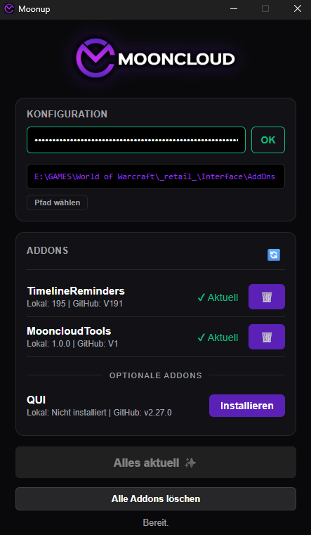

  

  # Moonup
  
  **Der automatische Addon-Updater für Mooncloud**

  
  
  

   

  [**⬇️ Download für Windows & Mac**](https://github.com/Mooncloudgg/MoonUp/releases/latest)

---

## Über das Projekt

**Moonup** ist ein kleines, leistungsstarkes Tool, das sicherstellt, dass alle Gildenmitglieder immer die exakt gleichen Versionen unserer wichtigen Addons haben. So ist niemand gezwungen WoWUP zu nutzen und kann seine eigenen Addons mit dem Manager seiner Wahl verwalten. 

* ✅ **Automatische Updates:** Prüft bei jedem Start, ob neue Versionen auf GitHub verfügbar sind.
* ✅ **Sicherheit:** Funktioniert nur mit gültigem Token.
* ✅ **Clean:** Installation für Auto-Updates notwendig.
* ✅ **Cross-Platform:** Läuft auf Windows und macOS.

---

## 🛡️ Sicherheit & Transparenz

Da Moonup ein privates Community-Projekt ist und keine kostspielige digitale Signatur (Zertifikat) besitzt, stufen manche Antiviren-Programme das Tool vorsichtshalber als "unbekannt" oder "verdächtig" ein.

* **Open Source:** Der gesamte Quellcode ist hier auf GitHub für jeden einsehbar.
* **Neutraler Build:** Die ausführbaren Dateien werden automatisch durch GitHub Actions auf Microsoft-Servern erstellt, nicht auf einem privaten PC.
* **Viren-Scan:** Ein aktueller Scan bei Jotti's Malware Scan zeigt die Unbedenklichkeit der Datei:
  👉 [**Hier das Scan-Ergebnis einsehen**](https://virusscan.jotti.org/de-DE/filescanjob/96ivfwtj31)
---

## 📥 Installation & Nutzung

### Windows 🪟

1.  Lade die Datei **`.exe`** unter [Releases](https://github.com/Mooncloudgg/MoonUp/releases/latest) herunter.
2.  Starte direkt die `.exe`.
3.  *Hinweis:* Da wir kein teures Microsoft-Zertifikat haben, erscheint evtl. eine blaue Warnung ("Der Computer wurde geschützt"). Klicke auf **Weitere Informationen** -> **Trotzdem ausführen**.

### macOS 🍎

1.  Lade die passende Datei unter [Releases](https://github.com/Mooncloudgg/MoonUp/releases/latest) herunter:
    * **M1/M2/M3 Chips:** `..._aarch64.dmg`
    * **Intel Chips:** `..._x64.dmg`
2.  Öffne die `.dmg` Datei und ziehe die App in den Programme-Ordner.
3.  **Wichtig beim ersten Start:**
    * Rechtsklick auf die App -> **Öffnen**.
    * Im Fenster bestätigen mit **Öffnen**.
    * (Ein Doppelklick reicht beim allerersten Mal nicht, da Apple Entwickler ohne Zertifikat blockiert).

---

## 🛠️ Einrichtung

1.  Starte Moonup.
2.  Gib deinen **Token** ein (den du im Discord findest).
3.  Wähle deinen **WoW `_Addons_` Ordner** aus.
4.  Klicke auf **Aktualisieren** oder **Installieren**.

---

  <small>Developed by Berry & Martin</small>

